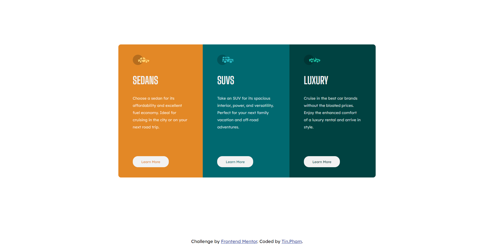

# Frontend Mentor - 3-column preview card component solution

This is a solution to the [3-column preview card component challenge on Frontend Mentor](https://www.frontendmentor.io/challenges/3column-preview-card-component-pH92eAR2-). Frontend Mentor challenges help you improve your coding skills by building realistic projects. 

## Table of contents

- [Overview](#overview)
  - [The challenge](#the-challenge)
  - [Screenshot](#screenshot)
  - [Links](#links)
- [My process](#my-process)
  - [Built with](#built-with)
  - [What I learned](#what-i-learned)
  - [Useful resources](#useful-resources)
- [Author](#author)

## Overview

### The challenge

Users should be able to:

- View the optimal layout depending on their device's screen size
- See hover states for interactive elements

### Screenshot

# Mobile Design

# Desktop Design

### Links

- Solution URL: [Add solution URL here](https://www.frontendmentor.io/solutions/mobilefirst-solution-using-css-flexbox-vmQl9JXOY)
- Live Site URL: [Add live site URL here](https://pensive-johnson-68c709.netlify.app)

## My process

### Built with

- Base HTML5 markup
- HTML divs, classes, paragraphs and buttons
- CSS Flexbox
- CSS Variable
- Mobile-first workflow

### What I learned

I learn how to work with git, github and my first challenge I took from FrontendMentor

### Useful resources

- [CSS Variable](https://www.youtube.com/watch?v=PHO6TBq_auI&list=PL4-IK0AVhVjOT2KBB5TSbD77OmfHvtqUim) - This help me understand and use effectively CSS Variable
- [Git and GitHub](https://www.youtube.com/watch?v=BCQHnlnPusY&list=PLRqwX-V7Uu6ZF9C0YMKuns9sLDzK6zoiV) - This help me understand the concept of Git and GitHub, I want to do the challenge on FrontEndMentor so bad but don't know how to work with Git and Github, so I learned from this

## Author

- Website - [Tin.Pham](https://github.com/tin-pham)
- Frontend Mentor - [@phambaohuy12345](https://www.frontendmentor.io/profile/phambaohuy12345)
- Facebook - [Tin Pham](https://www.facebook.com/joseph.webdev)

